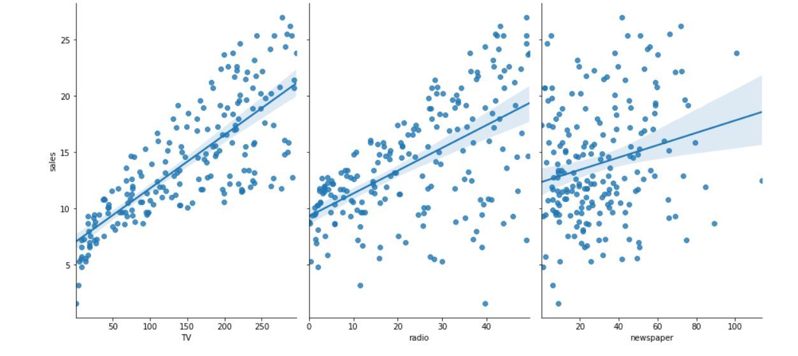
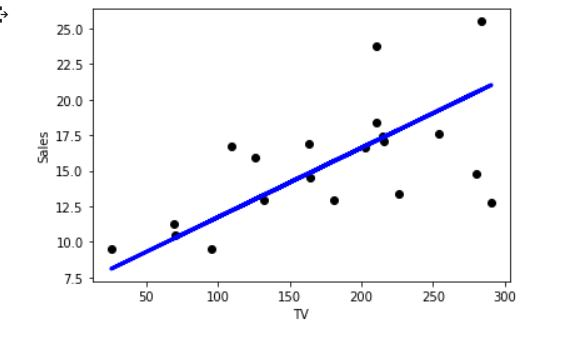
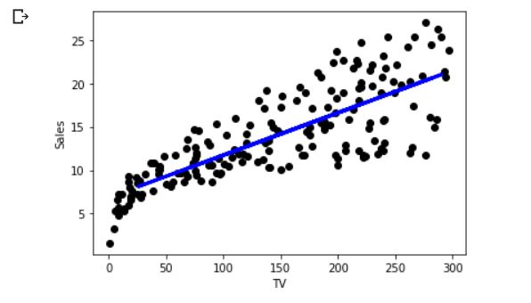

## Predict Sales Revenue with scikit-learn

Implemented an linear regression model of an advertising dataset using sklearn

The prediction was made on the impact of expenses in advertising on Sales 

**Expenses on TV advertising shows a liner growth on Sales as compared to other factors**

The Root Mean Squared Error was 3.468

**Test Model** 

**Trained Model**

